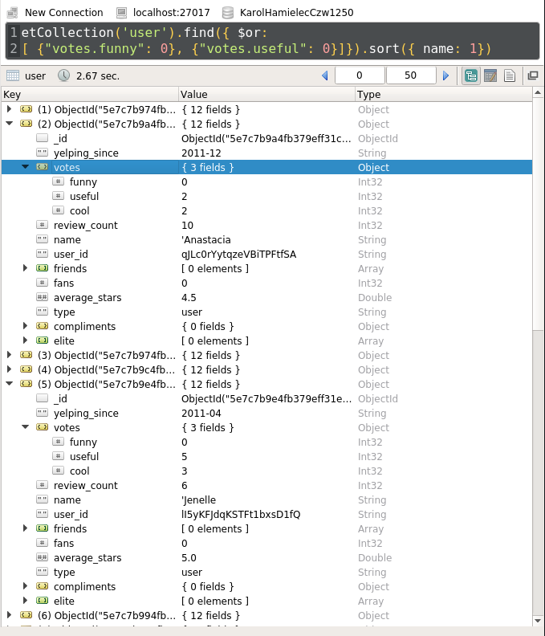

## zad.1

### Wykorzystując bazę̨ danych yelp dataset wykonaj zapytanie i komendy MongoDB, aby uzyskać́ następujące rezultaty:


 * #### a) Zwróć́ bez powtórzeń́ wszystkie nazwy miast w których znajdują się firmy (business). Wynik posortuj na podstawie nazwy miasta alfabetycznie.   

	
	
	
	
	```js
	
	db.getCollection('business').aggregate([
	  { $group: { _id: "$city" }},
	  { $sort: { _id: 1 }}
	])
		
	```
	
#  

 * #### b) Zwróć́ liczbę̨ wszystkich recenzji, które pojawiły się̨ po 2011 roku (włącznie). 
 

	


  ```js
  
    db.getCollection('review').aggregate([
    {$addFields: {yead: {$year: { $toDate: "$date"}}}},
    {$match: {year: {$gte: 2011}}},
    {$group: { _id: null, total: {$sum: 1}}},
    {$project: { _id: 0}}
    ])
  
  ```

 
 * #### c) Zwróć́ dane wszystkich zamkniętych (open) firm (business) z pól: nazwa, adres, gwiazdki (stars). 


	

#  
  
  ```js
  
    db.getCollection('business').find({
      {open : true},
      {name: 1, full_address: 1, stars: 1})
  
  ```

 * #### d) Zwróć́ dane wszystkich użytkowników (user), którzy nie uzyskali ani jednego pozytywnego głosu z kategorii (funny lub useful), wynik posortuj alfabetycznie według imienia użytkownika. 

 
 	
 
	```js
	
	db.getCollection('user').find({ $or: 
		[ {"votes.funny": 0}, {"votes.useful": 0}]}).sort({ name: 1})
		

	```
	

	
 * #### e) Określ, ile każde przedsiębiorstwo otrzymało wskazówek/napiwków (tip) w 2012. Wynik posortuj alfabetycznie według liczby (tip). 
 


	

	```js
	
	db.getCollection('tip').aggregate([
		{ $match: { date: {$regex: "^2012.*"}}},
		{ $group: { _id: "$business_id" , count: {$sum: 1}}},
		{ $sort: { count: 1 }}
	])

	```
	
#  

 * #### f) Wyznacz, jaką średnia ocen (stars) uzyskała każda firma (business) na podstawie wszystkich recenzji. Wynik ogranicz do recenzji, które uzyskały min 4.0 gwiazdki. 
 


	

	```js
	
	db.getCollection('review').aggregate([
		{$group: { _id: "$business_id", avg: {$avg: "$stars" }}},
		{$match: { avg: { $gt: 4.0}}}
	])

	```
	
#  
 * #### g) Usuń́ wszystkie firmy (business), które posiadają̨ ocenę̨ (stars) równą 2.0. 
#  

	

  ```js
  
    db.getCollection('business').remove({stars: { $eq: 2.0}})

  ```

## zad.2

Zdefiniuj funkcję (MongoDB) umożliwiającą dodanie nowej recenzji (review). Wykonaj przykładowe wywołanie.

#  


```js

function addReview(votes, user_id, review_id, stars, date, text, type, business_id) {
    // write your code here
    db.review.insert({
    votes: votes, 
    user_id: user_id, 
    review_id: review_id, 
    stars: stars,
    date: date, 
    text: text, 
    type: type, 
    business_id: business_id
    });
}
addReview({ funny: 2}, 3, 3, 3, "2020-04-14", "testsetest", "xd", 211213)

```


---


## zad.3

Zdefiniuj funkcję (MongoDB), która zwróci wszystkie biznesy (business), w których w kategorii znajduje się̨ podana przez użytkownika cechę̨. Wartość́ kategorii należy

#  

```js

function getBusinessWithCategory(cat) {
    // write your code here
    return db.business.find({ categories: cat});
}
getBusinessWithCategory("Food");

```


## zad.4

Zdefiniuj funkcję (MongoDB), która umożliwi modyfikację nazwy użytkownika (user) na podstawie podanego id. Id oraz nazwa mają być przekazywane jako parametry.

#  


---


```js

function modifyName(id, name) {
    // write your code here
    db.user.update({_id: id},{$set: { name:name}});
}
modifyName(ObjectId("5e7c7b964fb379eff31af9b3"), "Karol");

```

## zad.5

Zwróć́ średnią ilość́ wszystkich wskazówek/napiwków dla każdego z biznesów, wykorzystaj map reduce. 

#  

```js

var mapF = function(){
    emit (this.business_id, this.likes)
};

var reduceF = function( business_id, valuesLikes){
    return Array.avg(valuesLikes);
};

db.tip.mapReduce(mapF, reduceF, { out: "avg_likes_per_business"})

```


## zad.6

Odwzoruj wszystkie zadania z punktu 1 w języku programowania (np. JAVA) z pomocą̨ API do MongoDB. Wykorzystaj dla każdego zadania odrębną metodę̨

#  

```python

import pymongo
from bson.son import SON
from bson.code import Code


def zada( client):
    return client['business'].aggregate([ { "$group": { "_id": "$city"}}, { "$sort": { "_id": 1}} ])

def zadb(client):
    return client['review'].aggregate([ 
        {'$addFields': { 'year': { '$year': {'$toDate': "$date"}}}},
        {'$match': {'year': {'$gte': 2011 } } },
        {'$group': { '_id': 'null', 'total': { '$sum': 1}}}, 
        {'$project': {'_id': 0}} 
        ])

def zadc(client):
    return client['business'].find({'open': False}, { 'name': 1, 'full_address': 1, 'stars': 1})

def zadd(client):
    return client['user'].find({ '$or': [{'votes.funny': 0}, {'votes.useful': 0}] }).sort([( 'name', 1)])

def zade(client):
    return client['tip'].aggregate([
        { '$match': { 'date': { '$regex': "^2012.*"}}},
        { '$group': { "_id": "$business_id", "count": { '$sum': 1}}},
        { '$sort': { "count": 1}}
	])

def zadf(client):
    return client['review'].aggregate([
        { '$group': { '_id': "$business_id", 'avg': { '$avg': "$stars" }}},
        { '$match': { 'avg': { '$gt': 4.0}}}])

def zadg(client):
    return client['business'].remove({ 'stars': { '$eq': 2.0 }})

if __name__ == '__main__':
    host = 'localhost'
    port =  27017
    db = 'KarolHamielecCzw1250'
    cl = pymongo.MongoClient( host, port)

    l2 = list(zadg(cl[db]))
    print(l2)


```

## zad.7

Kolekcja kienci:

```js

{
  name: "",
  email: "",
  phone_number: 123456789
  address: {
    city: ""
    street: ""
    postal_code: ""
  },
  created: "2020-02-02"
}

```

Kolekcja przedmioty:

```js

{
  name: "",
  price: 10.0
  avaiability: true
}

```

Kolekcja zakupy:

```js

{
  user_id: "",
  cart: [ { item_id: "", qty: 3 },
          { item_id: "", qty: 23 }, 
          { item_id: "", qty: 16 }],
  date: "2020-02-02",
  payment_made: "2020-02-03"
}

```